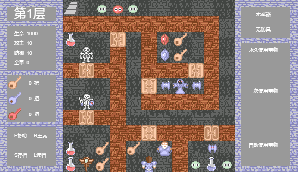

# MAGIC-TOWER-JS
HTML5 Canvas版的魔塔游戏

## 项目介绍
这是一个移植到 HTML5 平台的50层魔塔游戏，使用 Canvas 技术开发，
游戏还未开发完成，存在一些Bug，但大部分功能都已经实现，只写完了前10层的事件部分。

详细介绍可以参阅我的文章：[HTML5 canvas 游戏设计：创建一个经典的魔塔游戏](https://blog.csdn.net/m8705/article/details/86628153)

## 游戏截图

## 运行项目
在任意电脑下载项目的 ZIP 文件，打开 index.html 文件即可开始游玩。
如感觉画面太小，可以使用鼠标滚轮缩放页面以调整大小。

## 定制魔塔

在 **data.js** 内可以修改角色属性和地图数据
在 **role.js** 内可以修改怪物对象的信息
在 **action.js** 内可以修改对话文本的内容
在 **event.js** 内修改事件处理的逻辑

## 图片版权
该项目使用的图片来源于网络，非本人所有，仅用作学习用途。